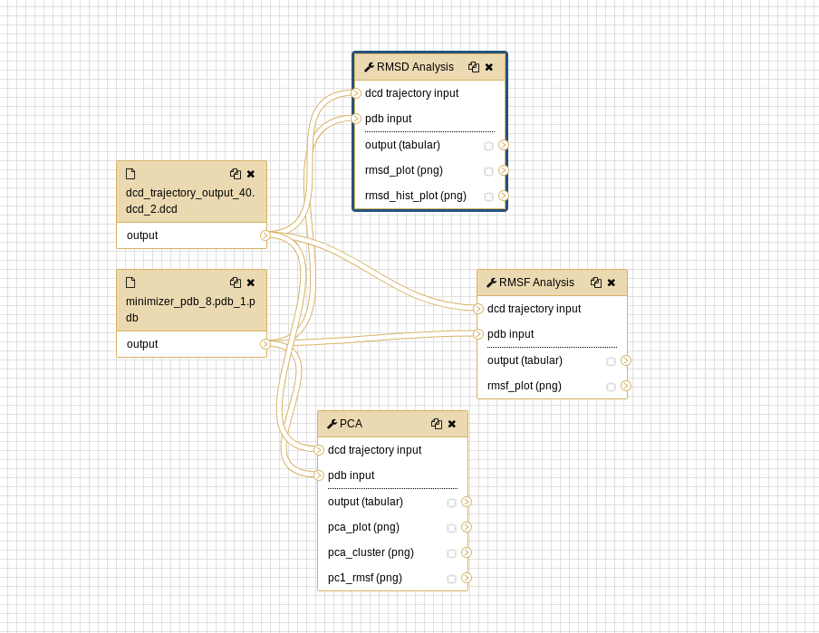
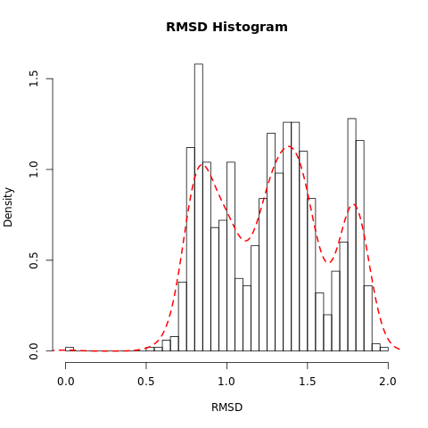

# Introduction
{:.no_toc}

We illustrate some of the analytical tools able to investigate conforma-
tional changes by analysis of a typical short protein simulation such as
for CBH1.

Protein conformational changes can be investigated in greater detail
using tools in the statistical analyses module. Here PCA was used to
discover the statistically meaningful conformations in the CBH1
trajectory. The principal motions within the trajectory and
the vital motions needed for conformational changes were identified.
Two distinct groupings along the PC1 plane indicating a non-periodic conformational change are identified. The groupings along the PC2 and PC3 planes do not completely cluster separately implying that these global motions are periodic. The PC1 is linked to an active site motion that limits the motion to a key glycosidic bond.

There are other analysis tools available you are encourage to try these out too. 

> ### Agenda
>
> In this tutorial, we will cover:
>
> 1. TOC
> {:toc}
>
{: .agenda}

# Get data

The data required will need to be generated by completing the previous tutorial.

# Analysis with BIO3D

It comes first a description of the step: some background and some theory.
Some image can be added there to support the theory explanation:

The idea is to keep the theory description before quite simple to focus more on the practical part.

***TODO***: *Consider adding a detail box to expand the theory*

> ###  More details about the theory
>
> But to describe more details, it is possible to use the detail boxes which are expandable
>
{: .details}

## Step with **bio3d_rmsd**

> ###  Hands-on: Task description
>
> 1. **toolshed.g2.bx.psu.edu/repos/chemteam/bio3d_rmsd/bio3d_rmsd/2.3**  with the following parameters:
>
>    ***TODO***: *Check parameter descriptions*
>
>    ***TODO***: *Consider adding a comment or tip box*
>
>    > ###  Comment
>    >
>    > A comment about the tool or something else. This box can also be in the main text
>    {: .comment}
>
{: .hands_on}

***TODO***: *Consider adding a question to test the learners understanding of the previous exercise*

> ###  Questions
>
> 1. Question1?
> 2. Question2?
>
> > ###  Solution
> >
> > 1. Answer for question1
> > 2. Answer for question2
> >
> {: .solution}
>
{: .question}

## Step with **bio3d_rmsf**

> ###  Hands-on: Task description
>
> 1. **toolshed.g2.bx.psu.edu/repos/chemteam/bio3d_rmsf/bio3d_rmsf/2.3**  with the following parameters:
>
>    ***TODO***: *Check parameter descriptions*
>
>    ***TODO***: *Consider adding a comment or tip box*
>
>    > ###  Comment
>    >
>    > A comment about the tool or something else. This box can also be in the main text
>    {: .comment}
>
{: .hands_on}

***TODO***: *Consider adding a question to test the learners understanding of the previous exercise*

> ###  Questions
>
> 1. Question1?
> 2. Question2?
>
> > ###  Solution
> >
> > 1. Answer for question1
> > 2. Answer for question2
> >
> {: .solution}
>
{: .question}

## Step with **bio3d_pca**

> ###  Hands-on: Task description
>
> 1. **toolshed.g2.bx.psu.edu/repos/chemteam/bio3d_pca/bio3d_pca/2.3**  with the following parameters:
>
>    ***TODO***: *Check parameter descriptions*
>
>    ***TODO***: *Consider adding a comment or tip box*
>
>    > ###  Comment
>    >
>    > A comment about the tool or something else. This box can also be in the main text
>    {: .comment}
>
{: .hands_on}

# Conclusion
{:.no_toc}

Sum up the tutorial and the key takeaways here. We encourage adding an overview image of the
pipeline used.
