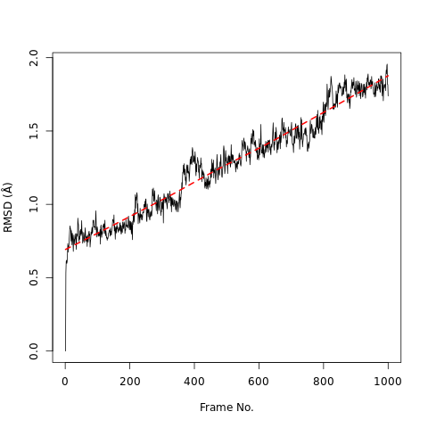
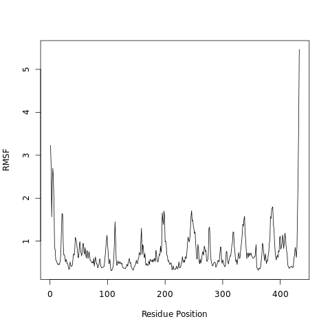
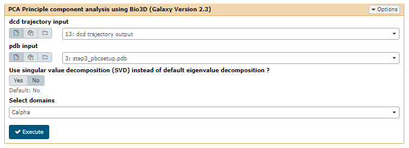
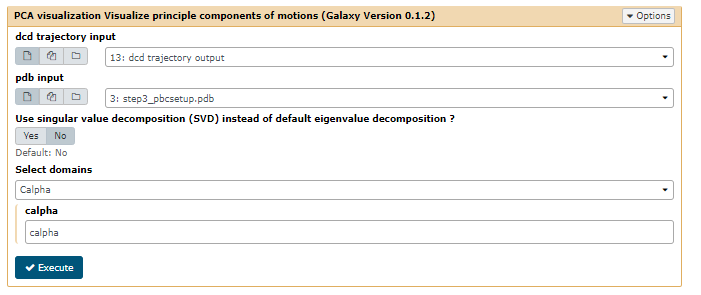
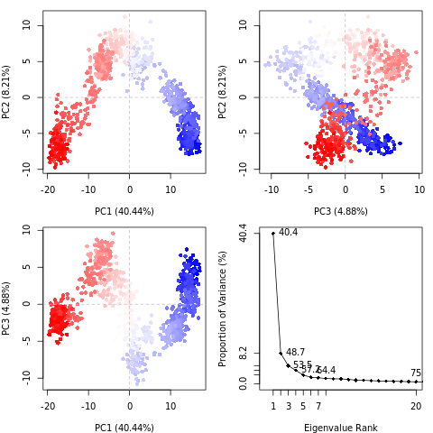
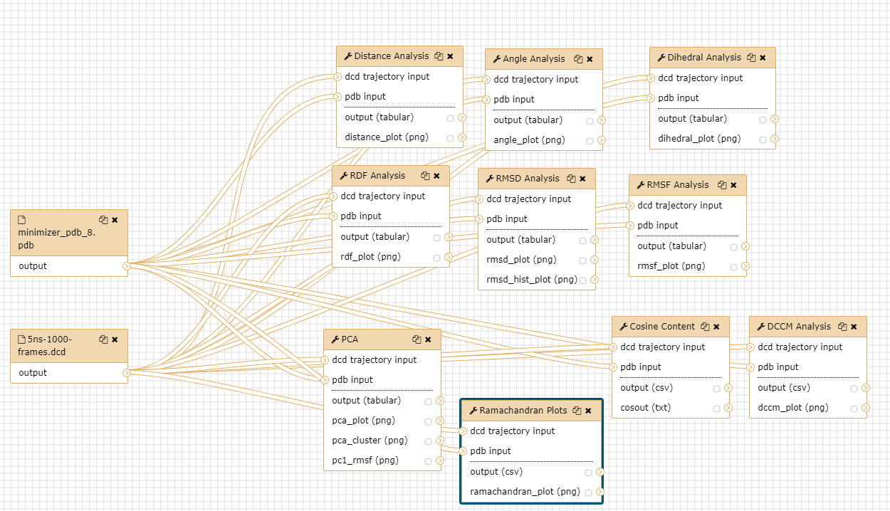

# Introduction
{:.no_toc}

We illustrate some of the analytical tools able to investigate conformational changes by analysis of a typical short protein simulation such as
for CBH1.

Protein conformational changes can be investigated in greater detail
using tools in the statistical analyses module. Here PCA was used to
discover the statistically meaningful conformations in the CBH1
trajectory. The principal motions within the trajectory and
the vital motions needed for conformational changes were identified.
Two distinct groupings along the PC1 plane indicating a non-periodic conformational change are identified. The groupings along the PC2 and PC3 planes do not completely cluster separately implying that these global motions are periodic. The PC1 is linked to an active site motion that limits the motion to a key glycosidic bond.

There are other analysis tools available you are encourage to try these out too. 

> ### Agenda
>
> In this tutorial, we will cover:
>
> 1. TOC
> {:toc}
>
{: .agenda}

# Get data

The data required will need to be generated by completing the previous tutorial.
Access it from your history.
If unavailable, use one of the published histories:

# Analysis with BIO3D

As per the slides we'll carry out some basic analysis by calculating RMSD, RMSF and PCA.

## Workflow or adhoc 
You can choose to use the existing workflow or click on tools one by one (see below).

Have a look at published workflows (and histories) and choose Conformational Changes Analysis.

## **bio3d_rmsd**

> ###  Hands-on: Calculate RMSD
>
> 1. **bio3d_rmsd/2.3**  with the following parameters:
> The Root Mean Square Deviation (RMSD) is a standard measure of structural distance between coordinates. This tool can calculate and plot the RMSD of the selected section.
{: .hands_on}

## **bio3d_rmsf**

> ###  Hands-on: Calculate RMSF
>
> 1. **bio3d_rmsf/2.3**  with the following parameters:
> The Root Mean Square Fluctuation (RMSF) conformational variance that analysis can analyze the portions of structure that are fluctuating from their mean structure the most (or least). This tool can calculate and plot the RMSF of the selected section.
{: .hands_on}

## **bio3d_pca**

> ###  Hands-on: Calculate PCA
>
> 1. **bio3d_pca/2.3 and pcavis**  with the following parameters:
> PCA can be used to determine the relationship between statistically meaningful conformations (major global motions) sampled during the trajectory.
> PCA visualisation: This tool can generate small trajectories of the first three principle components. The .pdb of the .nc files can be visualized using a visualization software such as VMD.
>
{: .hands_on}

# Further analysis

Explore further analyses, try out the advanced analysis workflow which includes a Ramachandran plot and various timeseries.

# Conclusion
{:.no_toc}

